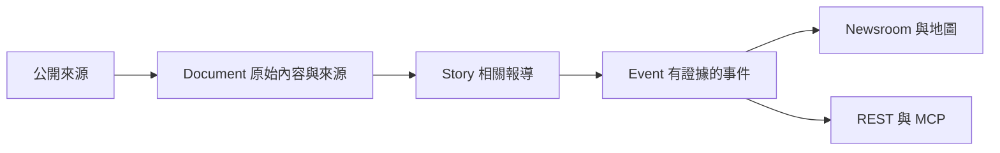

# Open Intel Atlas

**把公開資訊整理成可追溯的故事與事件。**

Open Intel Atlas（OLA）是一套本機優先的新聞與公開情報工作台。它持續蒐集政治、科技、金融與災害來源，保留原文連結、時間與證據，讓你先掌握重點，再查看資訊從哪裡來、可信到什麼程度。

[開始使用](docs/guides/getting-started.md) · [功能導覽](docs/guides/feature-tour.md) · [API 與 MCP](docs/guides/api-and-mcp.md) · [完整文件](docs/README.md)


## 你可以用它做什麼

| 需求 | OLA 提供的工作方式 |
| --- | --- |
| 快速掌握跨領域動態 | Newsroom 頭條、最新報導、live desk 與資料缺口 |
| 深入追查一件事 | 從 Story／Event 回到 Document、來源與證據 |
| 聚焦台灣、日本或東亞 | 區域 brief 保留 relevance、coverage 與不足原因 |
| 理解事件分布 | 獨立世界地圖；只有可靠座標的事件才放置 marker |
| 供應其他研究工具 | Versioned REST、read-only MCP 與可續接 change feed |
| 知道資料是否可靠 | 分別查看來源狀態、更新時間、驗證狀態與覆蓋缺口 |

金融是公開資訊與事件研究領域；OLA 不提供即時行情真相、投資建議或自動交易。OMI、Kuro 等 consumer 各自保有市場判斷、對話及通知責任。

## 從來源到可查證的情報



不是每一篇文章、每一個價格變動或每一篇論文都會成為 Event。資料由同一套 backend 保存與解讀，畫面和外部工具共用 freshness、coverage 與 evidence。

## 五分鐘開始

需要 **Node.js 24 以上**與 npm。以下命令從新 checkout 啟動：

```powershell
git clone https://github.com/lulu930128/Open-Intel-Atlas.git
Set-Location Open-Intel-Atlas
npm ci
Copy-Item .env.example .env
npm start
```

開啟 [本機 Newsroom](http://127.0.0.1:8790)。預設會建立 SQLite 並啟動已啟用來源的排程；想先離線檢查，可在啟動前設置 `ATLAS_AUTO_COLLECT=false`。既有安裝不要覆蓋自己的 `.env`。

Windows 可使用托盤管理常駐服務。完整步驟、設定及更新注意事項見[安裝指南](docs/guides/getting-started.md)與[維運指南](docs/guides/operations.md)。

## 資料限制也是結果的一部分

- 缺少憑證、來源停用、抓取失敗與資料過期會保留各自狀態，不用假資料填補。
- 區域內容不足時，brief 可以比較短；不以不相關內容填滿。
- 官方主張、單一來源與獨立交叉佐證分開表達。
- 無法定位的事件仍可出現在列表，不會被放到猜測座標。
- 圖片只在來源與展示政策允許時顯示，否則保留文字及原文連結。

資料供應、圖片與文章內容另受上游政策限制，詳見[來源與媒體政策](docs/guides/sources-and-media.md)。

## 文件與專案資訊

| 使用 | 開發與整合 |
| --- | --- |
| [安裝與設定](docs/guides/getting-started.md) | [開發指南](docs/guides/development.md) |
| [功能導覽](docs/guides/feature-tour.md) | [API／MCP 入門](docs/guides/api-and-mcp.md) |
| [更新、備份與排錯](docs/guides/operations.md) | [架構與資料模型](docs/architecture/index.md) |
| [來源與媒體政策](docs/guides/sources-and-media.md) | [產品方向與路線圖](docs/product/Roadmap.md) |
| [問題回報](SUPPORT.md) | [參與貢獻](CONTRIBUTING.md) |

[變更紀錄](CHANGELOG.md) · [安全回報](SECURITY.md) · [Apache License 2.0](LICENSE)

文件基準為已提交的 1.3 系列 source，詳見[實作狀態](docs/architecture/CurrentImplementationState.md)。公網服務、完整通知 delivery、多節點部署及 consumer 正式採用不因本機 API 可用就視為完成。
