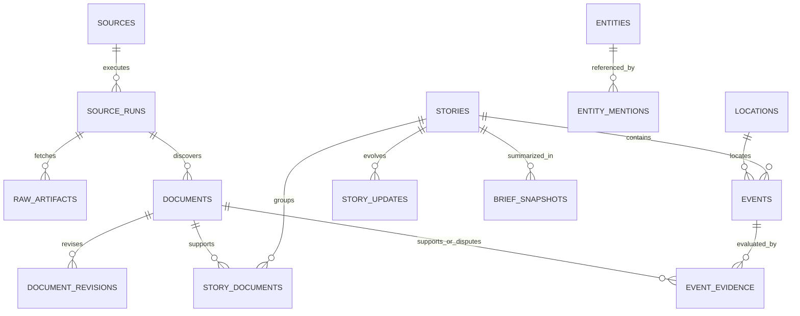

# Canonical Data Model

## 1. 目的

資料模型必須把「來源抓到什麼」、「文章在說什麼」、「系統認為哪些內容屬於同一故事」與「有哪些可結構化的事件」分開。若直接把每篇來源轉成 Event，後續去重、修正、交叉佐證與 OMI/Kuro evidence lineage 都會失真。

## 2. 核心實體

| Entity | 說明 | 主要 identity |
| --- | --- | --- |
| `sources` | 來源定義與政策 | versioned `source_id` |
| `source_runs` | 一次來源執行 | `run_id`；含 started/finished/status/error class |
| `raw_artifacts` | bounded HTTP payload 與 metadata | source + request + content hash |
| `documents` | normalized publisher/API item | source + external ID，或 canonical URL/content identity |
| `document_revisions` | 同一 Document 的內容修正 | document + revision/content hash |
| `stories` | 同一發展中故事的聚合 | stable story ID + cluster version |
| `story_documents` | Story 與 Document many-to-many lineage | story + document + relation/method |
| `events` | 從 evidence 建立的結構化發生事項 | stable event ID + event type/time/entity identity |
| `event_evidence` | Event 的 supporting/disputing evidence | event + document + stance |
| `entities` | 人、組織、公司、資產、產品等 | namespace + canonical key |
| `entity_mentions` | Document/Story/Event 中的實體提及 | owner + entity + span/method |
| `locations` | 有來源的地點與座標 | provider/geoname key 或 stable normalized key |
| `story_updates` | Story 的重要變化、correction、merge/split | story + update sequence |
| `brief_snapshots` | 特定查詢範圍的可重現摘要投影 | scope/filter hash + generated time + version |
| `processing_runs` | normalize/cluster/enrich/brief 的執行紀錄 | pipeline + version + input range |

## 3. 關係



## 4. Document contract

必要欄位：

```json
{
  "id": "doc_...",
  "source_id": "bbc-world-rss",
  "source_run_id": "run_...",
  "external_id": "publisher-id-or-null",
  "canonical_url": "https://publisher.example/story",
  "title": "...",
  "excerpt": "...",
  "document_type": "news",
  "language": "en",
  "published_at": "2026-08-23T08:00:00Z",
  "source_updated_at": null,
  "first_seen_at": "2026-08-23T08:05:00Z",
  "last_seen_at": "2026-08-23T08:05:00Z",
  "content_hash": "sha256:...",
  "domains": ["politics"],
  "topics": ["geopolitics"],
  "rights": {
    "storage": "metadata_excerpt",
    "redistribution": "link_only"
  },
  "normalization": {
    "method": "atlas-normalizer",
    "version": "1"
  }
}
```

規則：

- `excerpt` 有明確長度上限；原文內容保留在 publisher。
- `published_at` 無法解析時為 `null` 並保留 parse warning，不使用現在時間代替。
- canonical URL 失敗時仍可用 provider external ID；兩者皆無時才退回 bounded content identity。
- 同來源 revision 不建立一堆無關 Document；跨來源相似內容則保持不同 Document，再由 Story 聚合。

## 5. Story contract

```json
{
  "id": "story_...",
  "title": "...",
  "summary": "...",
  "primary_domain": "weather_disaster",
  "domains": ["weather_disaster", "finance"],
  "topics": ["typhoon", "supply_chain"],
  "status": "developing",
  "verification": {
    "status": "corroborated",
    "independent_source_count": 2,
    "official_source_count": 1,
    "method": "evidence-policy",
    "version": "1"
  },
  "freshness": {
    "status": "current",
    "as_of": "2026-08-23T08:10:00Z"
  },
  "first_seen_at": "2026-08-23T07:50:00Z",
  "last_updated_at": "2026-08-23T08:10:00Z",
  "cluster": {
    "method": "title-entity-time",
    "version": "1"
  }
}
```

Story status 可包含 `developing`、`stable`、`corrected`、`disputed`、`retracted`、`archived`。Story merge/split 應透過 `story_updates` 留痕，不可靜默讓外部 ID 指到完全不同內容。

## 6. Event contract

```json
{
  "id": "event_...",
  "story_id": "story_...",
  "event_type": "official_warning",
  "title": "...",
  "event_start_at": "2026-08-23T09:00:00Z",
  "event_end_at": null,
  "time_precision": "hour",
  "severity": "high",
  "verification": {
    "status": "official",
    "method": "evidence-policy",
    "version": "1"
  },
  "location_ids": ["loc_..."],
  "entity_ids": ["entity_..."],
  "evidence": [
    {
      "document_id": "doc_...",
      "stance": "supporting",
      "claim": "Issuing authority published the warning."
    }
  ]
}
```

規則：

- `event_start_at`、location、entity 未知時為 `null`／空陣列，不製造 placeholder 事實。
- `severity` 由 domain-specific policy 計算並版本化；不從文章情緒直接推導。
- `event_evidence.stance` 至少支援 `supporting`、`disputing`、`context`。
- 一個 Story 可包含多個 Event；例如警報發布、升級、登陸與解除是不同 timeline items。

## 7. Source independence

`independent_source_count` 不能直接等於 Document 數量。初期至少考慮：

- aggregator 與原 publisher 視為同一 evidence chain。
- 相同 canonical URL、明確轉載標記或高度相同內容不增加獨立數。
- 同一官方新聞稿被多家媒體原樣轉貼，媒體數不等於獨立確認數。
- official、professional media、research、community 等 `authority_class` 是描述，不是固定真實分數。

無法判定獨立性時使用 `unknown`，不要猜成獨立。

## 8. Freshness 與 coverage envelope

每個 query response 可聚合：

```json
{
  "freshness": {
    "status": "stale",
    "as_of": "2026-08-23T08:10:00Z",
    "expected_by": "2026-08-23T08:20:00Z"
  },
  "coverage": {
    "status": "partial",
    "expected_sources": 8,
    "successful_sources": 6,
    "failed_sources": 1,
    "disabled_sources": 1
  },
  "warnings": [
    {
      "code": "SOURCE_STALE",
      "source_id": "example-source",
      "message": "No successful run within configured cadence."
    }
  ]
}
```

空 `data` 可能代表真的沒有結果，也可能代表 missing/failed coverage；consumer 必須能從 envelope 分辨。

## 9. Migration 原則

- 先 dual-read 或 compatibility projection，不直接刪除 legacy DB。
- migration 每批記錄 input count、output count、skipped count、warning 與 checksum。
- legacy `geopolitics / infrastructure / finance / ai` 依明確 mapping 轉換；`infrastructure` 需要 item-level 判斷。
- migration 未驗證前，legacy 與 v1 API 不可宣稱完全等價。
- schema change 採 additive-first；breaking field removal 只在新 major API 進行。
