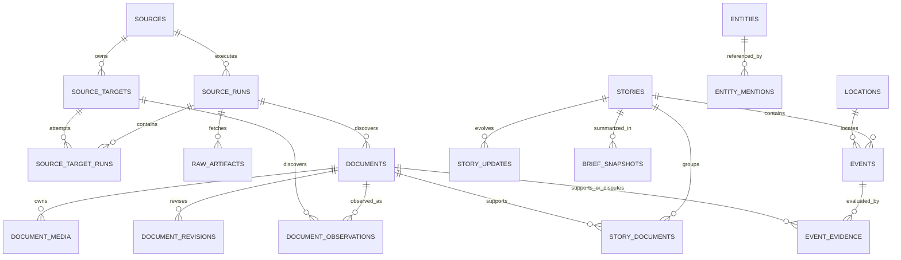

# Canonical Data Model

## 2026-09-08 分類與公告收斂（working tree，schema v8）

- `documents.classification_json` 保存 canonical classification 的 status、method/version、primary_domain、domain 理由及 source hints；`document_domains` 是同一決策的查詢投影。原始 metadata 與來源時間不因重分類覆寫。
- `src/atlasClassification.js` 是分類 owner。內容與文件型別優先，沒有內容規則命中時才使用降權的來源 hint；完全未知保持空 domains 並禁止 promotion。這是可稽核的 deterministic baseline，不宣稱完整語意理解或已測得分類準確率。
- `src/atlasPromotion.js` 對 TWSE／TPEx 公司公告區分 routine、material action、明確死亡職災與 materiality unconfirmed。條款、裸關鍵字、官方來源身分本身不代表重大性；不確定公告仍可從公告入口閱讀。
- `events.publication_status` 為 `published`／`held`，`publication_reason` 記錄政策撤下原因。它與 lifecycle、verification 分開；撤下不代表來源撤稿，不刪除 Event、Story、Document 或既有 Evidence。
- 一般 Event 列表、公司 Event 列表與其 REST/MCP consumers 僅查 published。Event ID 詳情與 change feed 仍保留歷史，`PUBLICATION_POLICY_CHANGED` 告知 consumer 撤下／重新發布。
- `applyClassificationConvergence` 是管理重算：單一 transaction、最多 10,000 Documents、超界拒絕。保持來源時間及 unrelated lifecycle；可修復決策已更新但 Event 尚未收斂的中斷狀態，連續重跑不產生額外寫入。
- 正式 DB 不會因 GET 或 schema migration 自動重分類；本輪採副本 apply-twice 驗證，正式 runtime adoption 另行執行。

## 1. 目的

資料模型必須把「來源抓到什麼」、「文章在說什麼」、「系統認為哪些內容屬於同一故事」與「有哪些可結構化的事件」分開。若直接把每篇來源轉成 Event，後續去重、修正、交叉佐證與 OMI/Kuro evidence lineage 都會失真。

## 2. 核心實體

| Entity | 說明 | 主要 identity |
| --- | --- | --- |
| `sources` | 來源定義與政策 | versioned `source_id` |
| `source_runs` | 一次來源執行 | `run_id`；含 started/finished/status/error class |
| `source_targets` | 同一 provider Source 下的 bounded entity/query targets 與各自排程狀態 | source + scoped identifier |
| `source_target_runs` | 單一 target 的成功、失敗、empty、latency 與 backoff audit | target + parent source run |
| `raw_artifacts` | bounded HTTP payload 與 metadata | source + request + content hash |
| `documents` | normalized publisher/API item | source + external ID，或 canonical URL/content identity |
| `document_observations` | provider／target 發現 canonical Document 的 lineage | document + source + target + discovered URL |
| `document_media` | Document-owned 圖片候選、rights/display policy 與 representative selection | document + normalized media URL；每個 Document 最多一筆 representative |
| `document_revisions` | 同一 Document 的內容修正 | document + revision/content hash |
| `stories` | 同一發展中故事的聚合 | stable story ID + cluster version |
| `story_documents` | Story 與 Document many-to-many lineage | story + document + relation/method |
| `events` | 從 evidence 建立的結構化發生事項 | stable event ID + event type/time/entity identity |
| `event_evidence` | Event 的 supporting/disputing evidence | event + document + stance |
| `entities` | 人、組織、公司、資產、產品等 | namespace + canonical key |
| `entity_mentions` | Document/Story/Event 中的實體提及 | owner + entity + span/method |
| `locations` | 有來源的地點與座標 | provider/geoname key 或 stable normalized key |
| `story_updates` | Story 的重要變化、correction、merge/split | story + update sequence |
| `brief_snapshots` | 特定查詢範圍的可重現摘要投影 | scope/filter hash + generated time + version |
| `processing_runs` | normalize/cluster/enrich/brief 的執行紀錄 | pipeline + version + input range |

## 3. 關係



## 4. Document contract

必要欄位：

```json
{
  "id": "doc_...",
  "source_id": "bbc-world-rss",
  "source_run_id": "run_...",
  "external_id": "publisher-id-or-null",
  "canonical_url": "https://publisher.example/story",
  "title": "...",
  "excerpt": "...",
  "document_type": "news",
  "language": "en",
  "published_at": "2026-08-23T08:00:00Z",
  "source_updated_at": null,
  "first_seen_at": "2026-08-23T08:05:00Z",
  "last_seen_at": "2026-08-23T08:05:00Z",
  "content_hash": "sha256:...",
  "domains": ["politics"],
  "topics": ["geopolitics"],
  "rights": {
    "storage": "metadata_excerpt",
    "redistribution": "link_only"
  },
  "normalization": {
    "method": "atlas-normalizer",
    "version": "1"
  }
}
```

規則：

- `excerpt` 有明確長度上限；原文內容保留在 publisher。
- `published_at` 無法解析時為 `null` 並保留 parse warning，不使用現在時間代替。
- canonical URL 失敗時仍可用 provider external ID；兩者皆無時才退回 bounded content identity。
- 同來源 revision 不建立一堆無關 Document；不同來源若提供完全相同 canonical URL，沿用第一個 canonical Document owner 並各自寫入 `document_observations`。只有語意相似但 canonical identity 不同時才保持不同 Documents，再由 Story 聚合。

### 4.1 Target 與 discovery lineage

- 一個 provider 是一個 Source；ticker／company／IR endpoint 是 `source_targets`，不得膨脹成一公司一 Source。
- target 的 `last_success_at`、`last_match_at`、failure 與 backoff 分開保存。成功但空的 fetch 可證明 coverage current，但不能補造 match。
- `documents.source_id` 是第一個 canonical owner；其他 provider 或 target 的發現只能新增 `document_observations`，不得覆寫 publisher、title 或 canonical policy。
- target-scoped identifier 可作 deterministic entity hint，但只證明 query scope；不能推測 feed 未提供的原始 publisher。

### 4.2 Document media contract

`document_media` 只保存 provider/feed 已明確提供的 image URL 與 bounded metadata，不由 read path 抓文章 HTML。`display_policy` 為 `blocked`、`candidate`、`link_only` 或 `remote_embed`；只有 source policy 同時核准 rights、明確展示授權、terms evidence、review time、HTTPS、allowed host 與 runtime usage context 時才可成為 `remote_embed`。`publisher_owned` 只描述所有權，不能單獨視為 Atlas 已獲遠端展示或 hotlink 授權。`UNIQUE(document_id, normalized_url)` 防止重抓重複，partial unique index 保證每個 Document 最多一筆 representative。Outward read 會將 persisted policy 與 current `sources.media_policy_json` 取較嚴格結果，再以代表 Document／supporting evidence 的 display-aware priority 選定 media；projection 必須保留實際 `document_id`／`source_id` lineage，不另存第二份 Story／Event 圖片 truth。

## 5. Story contract

```json
{
  "id": "story_...",
  "title": "...",
  "summary": "...",
  "primary_domain": "weather_disaster",
  "domains": ["weather_disaster", "finance"],
  "topics": ["typhoon", "supply_chain"],
  "status": "developing",
  "verification": {
    "status": "corroborated",
    "independent_source_count": 2,
    "official_source_count": 1,
    "method": "evidence-policy",
    "version": "1"
  },
  "freshness": {
    "status": "current",
    "as_of": "2026-08-23T08:10:00Z"
  },
  "first_seen_at": "2026-08-23T07:50:00Z",
  "last_updated_at": "2026-08-23T08:10:00Z",
  "cluster": {
    "method": "title-entity-time",
    "version": "1"
  }
}
```

Story status 可包含 `developing`、`stable`、`corrected`、`disputed`、`retracted`、`archived`。Story merge/split 應透過 `story_updates` 留痕，不可靜默讓外部 ID 指到完全不同內容。

## 6. Event contract

```json
{
  "id": "event_...",
  "story_id": "story_...",
  "event_type": "official_warning",
  "title": "...",
  "event_start_at": "2026-08-23T09:00:00Z",
  "event_end_at": null,
  "time_precision": "hour",
  "severity": "high",
  "verification": {
    "status": "official",
    "method": "evidence-policy",
    "version": "1"
  },
  "location_ids": ["loc_..."],
  "entity_ids": ["entity_..."],
  "evidence": [
    {
      "document_id": "doc_...",
      "stance": "supporting",
      "claim": "Issuing authority published the warning."
    }
  ]
}
```

規則：

- `event_start_at`、location、entity 未知時為 `null`／空陣列，不製造 placeholder 事實。
- `severity` 由 domain-specific policy 計算並版本化；不從文章情緒直接推導。
- `event_evidence.stance` 至少支援 `supporting`、`disputing`、`context`。
- 一個 Story 可包含多個 Event；例如警報發布、升級、登陸與解除是不同 timeline items。

## 7. Durable Story Update contract

Schema v3 以 `stories.version` 與 append-only `story_updates.sequence` 表達 consumer 可觀察的語意變化。Event state、Story version 與 update row 在同一 SQLite transaction 內提交；重抓相同 material state 不增加 version。

```json
{
  "id": "change_...",
  "sequence": 42,
  "story_id": "story_...",
  "event_id": "event_...",
  "story_version": 3,
  "change_type": "verification_changed",
  "primary_domain": "politics",
  "verification_status": "multi_source",
  "importance": {
    "level": "medium",
    "reason_codes": ["VERIFICATION_CHANGED", "EVIDENCE_CHANGED"]
  },
  "previous_state": {},
  "current_state": {},
  "evidence_ids": ["doc_..."],
  "occurred_at": "2026-08-23T08:10:00Z"
}
```

`change_type` 可表達 create/update、evidence added、verification/severity change、escalated/resolved、corrected/disputed/retracted。這些欄位保存可承載的 contract；只有 pipeline 實際辨識到對應 canonical state 時才會產生，不代表完整 correction NLP 已完成。

`/api/v1/changes` 對外使用 opaque cursor，不暴露 sequence 作為 consumer contract。Cursor 同時保存 filter scope，避免從 politics cursor 改查 hazards 時靜默漏掉資料。現階段不清除 update history；未來加入 retention 前必須先定義 `cursor_expired` 與 snapshot resync。

## 8. Source independence

`independent_source_count` 不能直接等於 Document 數量。初期至少考慮：

- aggregator 與原 publisher 視為同一 evidence chain。
- 相同 canonical URL、明確轉載標記或高度相同內容不增加獨立數。
- 同一官方新聞稿被多家媒體原樣轉貼，媒體數不等於獨立確認數。
- official、professional media、research、community 等 `authority_class` 是描述，不是固定真實分數。

無法判定獨立性時使用 `unknown`，不要猜成獨立。

## 9. Freshness 與 coverage envelope

每個 query response 可聚合：

```json
{
  "freshness": {
    "status": "stale",
    "as_of": "2026-08-23T08:10:00Z",
    "expected_by": "2026-08-23T08:20:00Z"
  },
  "coverage": {
    "status": "partial",
    "expected_sources": 8,
    "successful_sources": 6,
    "failed_sources": 1,
    "disabled_sources": 1
  },
  "warnings": [
    {
      "code": "SOURCE_STALE",
      "source_id": "example-source",
      "message": "No successful run within configured cadence."
    }
  ]
}
```

空 `data` 可能代表真的沒有結果，也可能代表 missing/failed coverage；consumer 必須能從 envelope 分辨。

## 10. Migration 原則

- 先 dual-read 或 compatibility projection，不直接刪除 legacy DB。
- migration 每批記錄 input count、output count、skipped count、warning 與 checksum。
- legacy `geopolitics / infrastructure / finance / ai` 依明確 mapping 轉換；`infrastructure` 需要 item-level 判斷。
- migration 未驗證前，legacy 與 v1 API 不可宣稱完全等價。
- schema change 採 additive-first；breaking field removal 只在新 major API 進行。

## 11. Macro canonical model（schema 11）

`src/macro/` 管理 Indicator → Release → Observation 與官方 evidence。資料期別使用 date-only `[period_start,period_end)`，`period_kind` 支援 month/week/quarter/year/event；週資料明確指定 ISO 或 Saturday-ending convention。對外 `reference_period` 保留相容，並新增 `period_key` 等欄位。

Release 的 stage/occurrence 是發布身分；Observation 的 revision_number 是本機觀測版本，不能冒充官方初值或 final。每個 Release 的 requirements_json 凍結所需指標、各自期別及必要性。Indicator metadata snapshot 與後端 display_semantics 保護歷史單位和口徑。

scheduled_at、source_published_at/timestamp_semantics、provider_published_at、first_observed_at、persisted_at、effective_at 各自表達不同時間，未知保持 null。macro_watch_windows 保存實際 scheduler evaluation 前態；macro_artifacts 依 type/hash 保存證據，不屬於數值 Observation，也不自動產生 Event。

schema 11 加入 `effective_date`、`scheduled_semantics` 與 append-only `macro_policy_decisions`。FOMC 只有生效日期時保留 date-only，`effective_at` 不填入假定午夜；決議上下限必須符合本次 Observation，statement 與 implementation note 保留各自 raw lineage。一般會議的 14:00 Eastern 預期時間標記為排程政策，不能冒充官方日曆明示時間。

正式 provider 包含 CPI/PPI/PCE、BLS Employment、BEA GDP、DOL Claims 與 Fed FOMC。詳見 [來源實作與正式驗證](../agent-runs/macro-sources/Progress.md) 與[泛化施工紀錄](../agent-runs/macro-generalization/Progress.md)。
