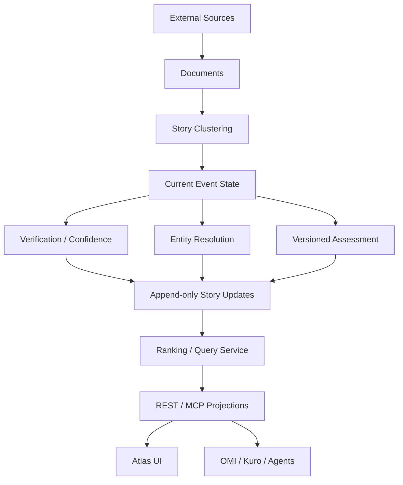

# Atlas Intelligence Layer 架構

## 文件狀態

- 類型：長期 target architecture。
- 來源：2026-08-25 使用者提出的 Intelligence Layer／股票新聞整合構想，以及目前 repo 的產品、資料與 consumer 邊界。
- 實作狀態：`規劃中`。本文件不表示 Assessment、Story Entity Link、Entity News、Top Stories ranking 或 `atlas.ask` 已完成。
- 目前順序：先完成 Atlas 後端；前端、OMI、Kuro 與其他 consumer adoption 後續逐步進行。

## 目標

Atlas 不只保存最近文章，而是將公開來源整理為可追溯、可版本化、可查詢的 intelligence：

1. 保存原始語言、來源、時間、權利限制與 evidence lineage。
2. 將多篇 Documents 聚合為持續演進的 Story／Event。
3. 分別表達 verification、confidence、severity、global importance 與 entity relevance。
4. 辨識 Story 狀態的 material change，而不是重複推送相似報導。
5. 以同一份 canonical truth 提供 bounded REST、MCP 與 consumer projections。
6. 由 entity link 產生股票／公司相關情報，不為每檔股票建立獨立 crawler 或 news database。

一句話定義：

> Open Intel Atlas 是 canonical global event and entity intelligence infrastructure。

## 現況基線

目前 source worktree 已包含：

- `Source → Document → Story → Event` canonical pipeline。
- SQLite schema v3 source、persistent scheduler 與 append-only `story_updates`。
- `/api/v1`、consumer contract `1.1` representation profiles、durable change feed。
- loopback-only read-only MCP transport。

2026-08-25 唯讀盤點同時確認：實際 `data/db/atlas.sqlite` 尚停在 migration v2，`127.0.0.1:8790` 沒有 listener。後續必須把 source readiness、DB migration、runtime adoption 與 consumer adoption 視為不同 gate。

本架構接續現有 Backend v1 與 Consumer Gateway，不建立競爭的第二套 backend、change log 或 canonical store。

## 責任邊界

| Owner | 擁有 | 不擁有 |
| --- | --- | --- |
| Atlas | source/document/story/event truth、evidence、verification、coverage、freshness、非市場性的事件重要度、entity identity 與關聯證據 | 行情、交易日、價格反應、投資判斷、通知 persona |
| OMI | instrument／ticker canonical semantics、market freshness、market reaction、股票／產業影響、投資情境與反證 | 重建 Atlas ingestion、Story clustering 或 evidence truth |
| Kuro | 使用者偏好、通知時機、安靜時間、persona、TTS 與互動 | 重算 Atlas verification/freshness 或 OMI market truth |
| GPT／其他 agent | 依 caller 權限與用途解釋已取得的 evidence／decision contract | 覆寫 canonical state 或把缺漏解讀為沒有事件 |

Atlas 可保存有來源、有效期與 confidence 的 ticker／external identifier alias，供 entity resolution 使用；OMI 仍是 instrument mapping 與 market semantics 的最終 owner。Atlas 不維護第二份 canonical market instrument database。

## Canonical flow

外部來源、scheduler 與 normalized Document 仍由現有 ingestion path 擁有。新 intelligence stages 必須能從既存 canonical evidence 重算，不在 public read request 中觸發無界 provider I/O。

## Canonical model 演進

### Entity identity

`entities` 是 canonical identity registry，不是每次抽取結果的暫存表。

必要規則：

- `entity_id` 穩定且不可因顯示名稱、ticker 或單篇文章變動。
- `canonical_name` 只能由明確 identity policy 更新，不能被事件地點 label 或單次 mention 覆寫。
- alias、identifier 與 mapping 保存 `source`、`method`、`confidence`、`valid_from`／`valid_to`。
- unresolved／ambiguous result 進入可觀測 queue；`Unknown != 0`，不可強行連結。
- company identity 與 market instrument identity 分開；同一公司可以有多市場、多 class、多時期 instrument。

建議新增或擴充：

- `entity_identifiers`
- `entity_aliases` provenance／normalization fields
- `entity_resolution_runs`
- `unresolved_entity_mentions`

### Story Entity Link

一個 Story 可以連到多個 entity；同一事件不按股票複製。

建議 contract：

- `story_id`
- `entity_id`
- `relationship_type`
- `relationship_confidence`
- `relevance_score`
- `entity_event_materiality`
- `reason_codes`
- `resolution_method/version`
- `evidence_ids`
- `first_detected_at`／`updated_at`

`entity_event_materiality` 只表示事件對該實體的業務、法律、營運或直接事實重要程度，不表示預期股價方向、報酬或交易建議；市場影響仍由 OMI 判定。

### Assessment

Assessment 是可重算、可比較、不能覆寫 evidence 的衍生資料。

建議 contract：

- `assessment_id`
- `story_id`／`event_id`
- `assessment_version`
- `assessment_method`
- `policy_profile`
- `evidence_hash`
- `generated_at`
- `impact_score`
- `scope_score`
- `urgency_score`
- `novelty_score`
- `momentum_score`
- `global_importance`
- `confidence`
- `reason_codes[]`
- `limitations[]`
- `warnings[]`

相同 evidence、policy 與 version 必須得到相同 deterministic 結果。未來若加入 LLM，只能作 bounded top-candidate semantic assessor，且輸出 structured JSON、model、prompt version 與 evidence hash；Atlas 在沒有 LLM 時仍須正確運作。

### Material Change

Material Change 不新增第二份 canonical change ledger。現有 `story_updates` 是唯一 durable change truth，後續擴充：

- `material_change_boolean`
- `change_importance`
- `assessment_id`
- `detection_method/version`
- 更細緻的 `change_type`
- `limitations`／`warnings`

目前建議維持「mutable current Event + append-only previous/current state」。若未來需要 immutable Event revision，必須先定義 migration、stable ID 與 consumer compatibility，不能同時保留兩種互相競爭的 timeline truth。

## Scoring axes

| Axis | 問題 | Owner |
| --- | --- | --- |
| `verification_status` | 有哪些證據支持、反駁或修正？ | Atlas evidence policy |
| `confidence` | 對目前結構化事實有多大把握？ | Atlas assessment policy |
| `severity` | 若為真，潛在後果強度多大？ | Atlas domain policy |
| `global_importance` | 在指定 policy/version 下，跨領域優先度多高？ | Atlas ranking policy |
| `entity_relevance` | Story 與 entity 的關係有多直接？ | Atlas entity link policy |
| `entity_event_materiality` | 對 entity 的非市場性事實重要程度多高？ | Atlas entity link policy |
| market impact／reaction | 市場如何反應或可能受影響？ | OMI |

規則：

- confidence 不直接加進 global importance。
- importance 不宣稱客觀「實際重要性」；對外帶 `policy_profile` 與 `assessment_version`。
- 缺少資料使用 `unknown`／limitations，不以 0 代替。
- domain-specific weights 保存在 versioned backend policy，不由 UI、MCP 或 consumer hardcode。

## Ranking 與 query

### Top Stories

主要依 `global_importance`，再以 material change、urgency、novelty、recency 與 diversity policy 排序。Confidence 必須獨立顯示，不用來掩蓋低可信度的高重要事件。

### Entity News

主要依 `entity_event_materiality`、`entity_relevance`、relationship type、material change 與 recency。回傳 canonical Story ID，不複製 Story／Document。

### `atlas.ask`

`atlas.ask` 是 deterministic intelligence query router，不是 mandatory LLM agent。

- structured parameters 是 authoritative input。
- `question` 僅能由 bounded parser 或上游 consumer 轉成 structured scope。
- 無法解析時回傳 predictable resolution error／warning，不默默猜測。
- 初始 intents：`top_stories`、`material_changes`、`entity_news`、`story_detail`、`timeline`、`evidence`、`freshness`。

## Consumer projection 與 payload budget

所有 outward response 共用 backend capability layer，依 versioned profile 投影。至少保留：

- stable IDs
- evidence references
- assessment/policy version
- freshness
- coverage
- warnings／limitations
- pagination／continuation state

每個 capability 必須同時有 item limit 與 serialized byte budget。超出預算時先裁減次要 evidence／歷史 timeline，不可裁掉 freshness、coverage、warnings 或 limitations；需要時提供 continuation token。

## Reliability 與 observability

後端至少量測：

- assessment／entity resolution／material change lag
- unresolved entity count 與 resolution conflict count
- Story merge/split、false duplicate 與 orphan link
- ranking policy/version 與 Top-K stability
- assessment cache hit／recompute count
- API latency、serialized bytes、projection truncation
- migration version、backup/restore result

所有自動 enrichment 保存 method/version；重跑必須 idempotent，單一 stage failure 只能造成該 projection `partial`，不得抹除既有 canonical evidence。

## Compatibility 與 rollout

1. additive schema migration，不刪除 legacy columns／tables。
2. 新 assessment、entity link 與 ranking 先 shadow 計算。
3. 以 fixtures 與 copied DB replay 比較新舊 Story/Event state。
4. 新 API/profile additive 上線；既有 `/api/v1`、legacy API 與 MCP tools 保留。
5. runtime adoption 另行驗證，source/test 通過不等於 live DB 已採用。
6. OMI/Kuro integration 只在 Atlas backend gate 完成後，以 read-only shadow flow 開始。

## Backend v1 完成定義

- canonical entity identity 不再被 contextual mention 覆寫。
- 一個 Story 可穩定連到多個 entity，ambiguous mention 不會自動誤連。
- deterministic Assessment 可重現，confidence 與 importance 分離。
- material change 透過唯一 `story_updates` ledger 保存並可續接。
- Top Stories 與 Entity News 使用 backend-owned policy，且公開版本、限制與 evidence。
- `atlas.ask` 的 structured intents 在無 LLM 下可用。
- response 具有 item／byte bounds，且 warnings／freshness 不被靜默裁掉。
- migration、idempotency、replay、contract、partial failure 與 runtime smoke gate 通過。

## 本階段 Non-goals

- 不修改 Atlas 前端。
- 不接 OMI／Kuro runtime，也不宣稱 consumer adoption。
- 不在 Atlas 計算市場反應、股價方向或投資結論。
- 不優先增加來源數量或全量翻譯既有內容。
- 不加入 mandatory LLM、vector database、PostgreSQL、Redis、queue 或微服務拆分。
- 不處理 public internet authentication／multi-tenant deployment。
