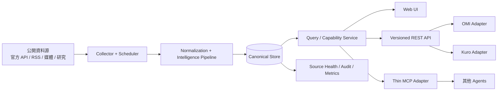
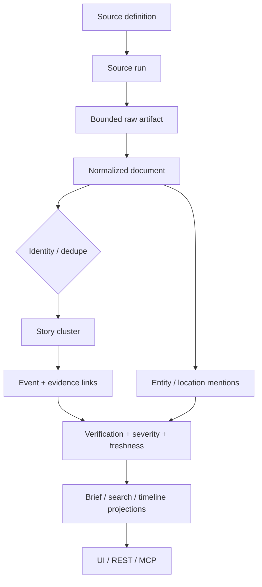

# Open Intel Atlas 系統架構

## 1. 文件目的

本文件定義 Open Intel Atlas 的長期 target architecture，支撐：

- 政治、科技發展、金融、氣象／重大天災等主要新聞領域。
- 醫療、能源、環境、社會等後續領域擴充。
- 人類使用的 UI。
- 對外 versioned API 與 read-only-first MCP。
- OMI、Kuro 與其他 agent 的一致資料供應。

本文件同時描述目前實作與長期 target。2026-08-23 的 runtime 已由 `src/atlasServer.js` 執行 `Source → Document → Story → Event` canonical pipeline、SQLite schema v2 scheduler 與 `/api/v1/*`；MCP、public auth、多實例部署及完整 correction/retraction workflow 仍屬後續範圍。

## 2. 架構原則

1. **Evidence first**：Document 是來源內容，Story 是相關內容群組，Event 是有 evidence 的結構化發生事項；三者不可混為一談。
2. **Backend owns semantics**：taxonomy、verification、freshness、coverage、severity 與 lineage 由 backend 定義，UI/MCP/consumer 只投影。
3. **Extensible taxonomy**：主要領域是產品導航，不是資料庫拓樸；新增領域不應新增一套 pipeline。
4. **Read path has no unbounded fetch**：API/UI 查詢讀 canonical store；外部抓取由 scheduler、bounded refresh 或管理工作負責。
5. **Partial is a valid state**：單一來源失敗不清空其他來源，也不把缺漏偽裝成零或 current。
6. **One canonical model, many views**：UI、REST、MCP、OMI、Kuro 使用同一套資料，只做有版本的 representation。
7. **Local-first, migration-ready**：單機 SQLite 是明確階段，不預先微服務化；容量或公開服務需求達 gate 後再演進。
8. **Content is untrusted input**：新聞文字、HTML、URL、metadata 與 LLM 輸出一律視為不可信資料。

## 3. 系統情境

信任邊界：

- `Sources → Collector` 是外部、不可信、可能失敗且受 rate limit 的邊界。
- `Store → Query` 是 canonical read boundary；所有 outward data limits 在此統一處理。
- `Query → API/MCP` 是公開能力邊界；authentication 與 authorization 只能在 server side 決定。
- `API/MCP → OMI/Kuro` 是產品責任邊界；consumer 不可覆寫 Atlas 的 evidence 狀態，Atlas 也不接管 consumer 的核心語意。

## 4. Target components

| Component | Target responsibility | 初期部署 |
| --- | --- | --- |
| Source Registry | source metadata、domain、authority、rights、cadence、required config、enabled policy | version-controlled module/table |
| Collector | HTTP policy、payload bounds、conditional request、retry、source adapter execution | backend process 內 bounded worker |
| Scheduler | cadence、jitter、startup catch-up、lease、concurrency、shutdown | backend process 內 scheduler |
| Raw Capture | 保存 bounded payload、hash、HTTP metadata、truncated flag | `atlas.sqlite` |
| Normalizer | 產生 stable `Document`、URL canonicalization、time/language/text normalization | pure/testable modules |
| Intelligence Pipeline | dedupe、Story clustering、Event/evidence、entity、geo、verification、brief projection | versioned pipeline jobs |
| Canonical Store | schema、migration、transactions、query indexes、audit lineage | SQLite WAL；達 gate 後再評估 PostgreSQL |
| Query Service | search/filter/pagination、freshness/coverage、representation | backend capability layer |
| REST API | public versioning、auth、rate limit、HTTP semantics | 同 backend 或獨立薄 transport |
| MCP Adapter | 少量 read-only tools/resources，轉呼叫 Query/API | 獨立薄 adapter |
| Web UI | operational briefing 與 evidence exploration | static/SPA；不得直連 provider |
| Admin Plane | refresh/backfill/reprocess/source controls/audit | 與 public tools 分離、local trusted 起步 |

## 5. Canonical data flow

### 不變條件

- `source_run` 失敗時，不建立 fake Document 或 fallback fake Event。
- 每筆 outward Event 至少連到一筆 Document evidence。
- 同一來源重抓的 Document identity 穩定；內容更新可建立 revision，不以新 ID 洗掉歷史。
- Story clustering 可重算，但 external stable ID 與 merge/split history 必須可追蹤。
- LLM 或 heuristic enrichment 保存 method/version，不覆寫 raw/normalized fields。

## 6. Taxonomy

### 6.1 領域模型

每筆 Story/Event 使用：

- `primary_domain`：主要 UI 歸屬，一個值。
- `domains[]`：可跨領域，多個值。
- `topics[]`：例如 `ai`、`semiconductor`、`election`、`earthquake`、`public_health`。
- `event_types[]`：例如 `policy_change`、`release`、`market_disruption`、`warning`、`disaster`。
- `entities[]`、`locations[]`：不以 category 字串代替實體或地區。

初始 domain registry：

| ID | 顯示名稱 | 狀態 |
| --- | --- | --- |
| `politics` | 政治 | 主領域 |
| `technology` | 科技發展 | 主領域 |
| `finance` | 金融 | 主領域 |
| `weather_disaster` | 氣象與重大天災 | 主領域 |
| `health` | 醫療與公共衛生 | 可擴充領域 |

資安、國防、能源、基礎設施與環境多半是 cross-cutting topic 或可選 domain；是否升格為主領域由產品決策，不由 adapter 自行新增。

### 6.2 Legacy mapping

| Legacy category | Target mapping | 注意事項 |
| --- | --- | --- |
| `geopolitics` | `primary_domain=politics` | 保留 `geopolitics` topic |
| `ai` | `primary_domain=technology` | 保留 `ai` topic |
| `finance` | `primary_domain=finance` | 市場 snapshot 不自動成為重大 Event |
| `infrastructure` | 依 evidence 映射至 `weather_disaster`、`technology` 或其他 domain | 不能整批盲目改名 |

Legacy API 在 deprecation window 內可保留 mapping，但 canonical store 不再以一類別一個 DB 分割。

## 7. 時間、可信度與資料狀態

### 7.1 時間欄位

- `event_start_at` / `event_end_at`：事件實際時間；未知時為 `null`。
- `published_at`：來源發布時間。
- `source_updated_at`：來源修正時間。
- `first_seen_at` / `last_seen_at`：Atlas 首次／最近觀測時間。
- `ingested_at`：寫入 canonical store 的時間。
- `generated_at`：brief 或 LLM artifact 產生時間。

所有 canonical timestamp 使用 UTC ISO 8601；UI 再轉換為 Asia/Taipei 或使用者時區。不得以 `ingested_at` 填補未知的 `event_start_at`。

### 7.2 分離的狀態軸

| 軸 | 建議值 | 回答的問題 |
| --- | --- | --- |
| `verification.status` | `unverified`、`single_source`、`corroborated`、`official`、`disputed`、`retracted` | 有哪些證據支持／反駁？ |
| `severity` | `info`、`low`、`medium`、`high`、`critical` | 若為真，潛在影響多大？ |
| `freshness.status` | `current`、`stale`、`unknown` | 資料相對於來源 cadence 是否夠新？ |
| `coverage.status` | `complete`、`partial`、`missing`、`disabled`、`unknown` | 預期來源有多少可用？ |
| `pipeline.status` | `pending`、`processed`、`failed`、`superseded` | 系統處理到哪裡？ |

`confidence` 若仍以 0..1 提供，必須附 `method`、`components` 與 `version`；UI 不可只顯示一個無法解釋的小數。

## 8. Collection 與 scheduler

- 每個 source 有獨立 cadence、timeout、response limit、retry policy、required config 與 circuit/backoff state。
- scheduler 使用 bounded concurrency；單一 source failure 不阻斷其他來源。
- 支援 conditional GET、stable cursor 或 provider checkpoint 時才做 incremental fetch。
- startup catch-up 依 provider 可回溯能力設定 window；powered-off 期間無法取得的內容標為 coverage gap。
- public read API 預設只讀 DB；管理者可提交 bounded refresh job，但 response 不同步等待長時間 provider I/O。
- reprocess 從既存 raw/document 開始，與 refetch 分開，避免不必要消耗 quota。

## 9. Storage 與演進

### 初期

- 單一 Node process、SQLite WAL、foreign keys、busy timeout、schema migration table。
- `atlas.sqlite` 是 v1 canonical store；既有 category/source/dashboard DB 為 legacy compatibility data。
- 以 transaction 寫入 `source_run → raw_artifact → document`，pipeline 可在後續 job 中處理。
- raw payload、excerpt、error detail 與 LLM artifact 具各自的 retention／redaction policy。

### 升級 gate

只有在量測證據顯示單機邊界不足時才引入 PostgreSQL、queue 或 worker separation，例如：

- collection 與 query 持續互相阻塞。
- DB size、write contention、backup/restore time 超過已確認 SLO。
- 需要多 host、高可用、多租戶或公開服務水平。
- pipeline job 需要可靠 lease、分散式 retry 或獨立擴縮。

演進時保留 Query/API contract，transport 與儲存替換不應迫使 OMI/Kuro 同步重寫。

## 10. UI information architecture

1. **Overview**：重大 stories、跨領域狀態、coverage/freshness、地圖與更新時間。
2. **Story detail**：摘要、timeline、Event、evidence、來源獨立性、entity/location、correction/retraction。
3. **Domains**：政治、科技、金融、災害與可擴充領域的趨勢與列表。
4. **Search**：全文／metadata 搜尋，支援 domain、topic、entity、location、time、verification、source filter。
5. **Sources**：registry、rights note、last run、last success/failure、cadence、coverage gap。
6. **System**：scheduler、pipeline lag、DB/schema、job failure、版本與 debug correlation ID。

地圖只顯示有明確 geo evidence 的 items；無座標事件仍在列表與搜尋中可見。

## 11. API、MCP 與 consumer

詳細 contract 見 [對外介面與整合契約](ExternalInterfaces.md)。核心規則：

- 使用 `/api/v1` major version 與 cursor pagination。
- response 同時帶 `data`、`meta`、`freshness`、`coverage`、`warnings`。
- source status 與 partial result 不藏在自由文字 summary。
- MCP 只轉呼叫 Query/API，第一版只提供 read-only capability。
- OMI 取得 external event evidence，不從 Atlas 接受交易結論。
- Kuro 取得 compact facts/brief，不從 Atlas 接受 persona 或通知決策。

## 12. Security、內容權利與 AI 安全

- Source Registry allowlist 決定可抓取 host；redirect 後仍需驗證，防止 SSRF 與私網探測。
- URL、HTML、XML、CSV 與 JSON 都需 size/depth bounds；UI output encoding 防止 stored XSS。
- 新聞中的 prompt-like 文字只是資料，不得改變 agent/system policy 或觸發工具。
- secrets、provider keys、trust token 不進 DB raw artifact、log、API error 或 git。
- 對外 API 需 TLS、authentication、rate limit、quota、request size limit 與 audit correlation ID。
- 保存與再散布以 source-specific rights matrix 控制；預設 metadata + short excerpt + link，不保存或回傳全文。
- LLM 摘要附 evidence IDs、model、prompt/version 與時間；生成失敗不影響 canonical evidence 查詢。

## 13. Observability 與驗證

至少量測：

- 每來源 run status、duration、HTTP class、document count、last success、next due。
- 各 domain 的 current/partial/stale coverage。
- payload truncated、parser failure、duplicate ratio、orphan Document、Event without evidence（必須為 0）。
- pipeline queue/lag、Story merge/split/revision、brief generation version。
- API latency/error、MCP call result、consumer contract version。

完成宣告分層：

1. source adapter fixture/live sample。
2. canonical DB/pipeline tests。
3. API contract/local smoke。
4. UI browser evidence。
5. MCP protocol smoke。
6. OMI/Kuro 實際 runtime adoption。

前一層健康不代表後一層完成。

## 14. 已知架構缺口

- 受支援的 runtime entrypoint 是 `src/atlasServer.js`；較早的 `src/server.js`、legacy collector 與 category store 仍留在 repo，但不再由 package script、測試或目前 runtime 引用，新功能不得建立在這條舊路徑上。
- Canonical Story/Event pipeline 已上線，但 clustering、entity extraction、severity 與 confidence 仍是 versioned deterministic baseline，尚未接完整 NLP 或 correction/retraction timeline。
- 自動測試已覆蓋 identity、dedupe、lineage、schema migration、lease/backoff、catch-up、304 與 domain freshness；malformed provider payload、rate-limit 與更多 adapter fixtures 仍需補強。
- `src/dashboard.js` 仍提供 legacy dashboard projection；它不擁有 canonical Story/Event truth，也不由查詢路徑抓取 provider。
- MCP、public auth、OMI/Kuro wiring 尚未實作。
- 需要逐來源完成 terms、attribution、redistribution 與 key-gated live acceptance，才能擴大到公網或第三方服務。

## 15. 待決策

優先需要使用者確認：部署範圍、多語策略、通知時效、保存期限、LLM 角色，以及是否把資安／能源／醫療升為第一級 domain。這些決策不阻擋 M1 canonical ingestion foundation，但會影響 UI、公開 API 與容量設計。
